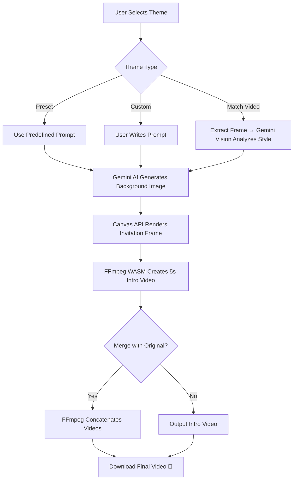

<div align="center">

# ✨ Invitation Personalizer

### AI-Powered Personalized Invitation Video Generator

Generate stunning, AI-crafted invitation backgrounds and personalized video intros — all from your browser.


</div>

---

## 📋 Table of Contents

- [About](#-about)
- [Features](#-features)
- [Demo](#-demo)
- [Tech Stack](#-tech-stack)
- [Getting Started](#-getting-started)
  - [Prerequisites](#prerequisites)
  - [Installation](#installation)
  - [Environment Variables](#environment-variables)
  - [Running Locally](#running-locally)
- [Deployment](#-deployment)
  - [GitHub Pages](#github-pages)
  - [Other Platforms](#other-platforms)
- [Project Structure](#-project-structure)
- [How It Works](#-how-it-works)
- [Contributing](#-contributing)
- [License](#-license)

---

## 🎯 About

**Invitation Personalizer** is a browser-based tool that helps you create beautiful, personalized invitation videos. Whether it's a wedding, celebration, or any special occasion, this app uses **Google Gemini AI** to generate gorgeous backgrounds and **FFmpeg (WASM)** to produce professional-quality video intros — all processed entirely in your browser with zero server-side rendering.

Perfect for Indian weddings with full **Hindi (Devanagari) text support** 🇮🇳

---

## ✨ Features

| Feature | Description |
|---|---|
| 🎨 **AI Background Generation** | Generate stunning invitation backgrounds using Google Gemini's image generation model |
| 🏛️ **Multiple Themes** | Choose from Traditional Indian, Modern Minimalist, Romantic Floral, Royal Rajput, or Yellow Ganesha Card styles |
| 🎯 **Video Style Matching** | Upload a video and let AI analyze & match its visual style for a seamless background |
| ✏️ **Custom Prompts** | Describe your dream background and let AI create it for you |
| 🔤 **Multilingual Text** | Full support for English and Hindi (Devanagari) text on invitations |
| 🎬 **Video Generation** | Create 5-second personalized intro videos with guest names |
| 🔗 **Video Merging** | Optionally merge the generated intro with your original invitation video |
| 📱 **Responsive Design** | Works beautifully on desktop and mobile devices |
| 🔒 **Privacy First** | All video processing happens in-browser via FFmpeg WASM — nothing is uploaded to any server |

---

## 🎥 Demo

> Upload your invitation video → Choose an AI background style → Enter guest name → Generate a personalized video intro!

---

## 🛠️ Tech Stack

| Technology | Purpose |
|---|---|
| [Next.js 15](https://nextjs.org/) | React framework with App Router |
| [React 19](https://react.dev/) | UI library |
| [TypeScript 5.9](https://www.typescriptlang.org/) | Type safety |
| [Tailwind CSS 4](https://tailwindcss.com/) | Utility-first styling |
| [Shadcn UI](https://ui.shadcn.com/) | Pre-built accessible components |
| [Google Gemini AI](https://ai.google.dev/) | Background image generation & video style analysis |
| [FFmpeg WASM](https://ffmpegwasm.netlify.app/) | In-browser video processing |
| [Noto Serif Devanagari](https://fonts.google.com/noto/specimen/Noto+Serif+Devanagari) | Hindi/Devanagari font support |
| [Lucide React](https://lucide.dev/) | Icon library |
| [Motion](https://motion.dev/) | Animations |

---

## 🚀 Getting Started

### Prerequisites

- **Node.js** >= 18.x
- **npm** >= 9.x (or yarn/pnpm)
- A **Google Gemini API Key** ([Get one here](https://aistudio.google.com/apikey))

### Installation

```bash
# Clone the repository
git clone https://github.com/YOUR_USERNAME/invitation-personalizer.git
cd invitation-personalizer

# Install dependencies
npm install
```

### Environment Variables

Create a `.env.local` file in the root directory:

```env
# Required: Your Google Gemini API key
GEMINI_API_KEY="your_gemini_api_key_here"

# Optional: App URL (for self-referential links)
APP_URL="http://localhost:3000"
```

> **Note:** See [`.env.example`](.env.example) for the full list of available environment variables.

### Running Locally

```bash
# Start the development server
npm run dev
```

Open [http://localhost:3000](http://localhost:3000) in your browser.

---

## 🌐 Deployment

### GitHub Pages

This project is configured for automated deployment to GitHub Pages using GitHub Actions.

**Setup Steps:**

1. **Push to GitHub:**
   ```bash
   git remote add origin https://github.com/YOUR_USERNAME/invitation-personalizer.git
   git push -u origin main
   ```

2. **Set the API key as a GitHub Secret:**
   - Go to your repo → **Settings** → **Secrets and variables** → **Actions**
   - Add a new secret: `NEXT_PUBLIC_GEMINI_API_KEY` with your Gemini API key

3. **Enable GitHub Pages:**
   - Go to your repo → **Settings** → **Pages**
   - Under **Source**, select **GitHub Actions**

4. **Deploy:**
   - Push to `main` branch — the workflow will automatically build and deploy

> **⚠️ Security Note:** The Gemini API key will be embedded in the client-side JavaScript bundle since this is a static export. For production use, consider implementing a server-side proxy for API calls.

### Other Platforms

Since the app uses `output: 'export'` for static generation, it can be deployed to any static hosting:

| Platform | Command |
|---|---|
| **Vercel** | `vercel deploy` |
| **Netlify** | Drop the `out/` folder |
| **Firebase** | `firebase deploy` |
| **AWS S3** | Upload `out/` to S3 bucket |

---

## 📁 Project Structure

```
invitation-personalizer/
├── .github/
│   └── workflows/
│       └── deploy.yml          # GitHub Actions CI/CD pipeline
├── app/
│   ├── globals.css             # Global styles & Tailwind/Shadcn theme
│   ├── layout.tsx              # Root layout with fonts
│   └── page.tsx                # Main application page
├── components/
│   └── ui/                     # Shadcn UI components
│       ├── button.tsx
│       ├── card.tsx
│       ├── input.tsx
│       ├── label.tsx
│       ├── progress.tsx
│       ├── select.tsx
│       ├── switch.tsx
│       └── textarea.tsx
├── hooks/
│   └── use-mobile.ts           # Mobile detection hook
├── lib/
│   └── utils.ts                # Utility functions (cn)
├── .env.example                # Environment variable template
├── .gitignore                  # Git ignore rules
├── components.json             # Shadcn UI configuration
├── next.config.ts              # Next.js configuration
├── package.json                # Dependencies & scripts
├── postcss.config.mjs          # PostCSS configuration
├── tsconfig.json               # TypeScript configuration
└── README.md                   # This file
```

---

## ⚙️ How It Works



1. **Background Generation** — Google Gemini's image generation model creates a beautiful background based on the selected theme or custom prompt
2. **Style Matching** — For "Match Original Video" mode, a frame is extracted and analyzed by Gemini Vision to describe the visual style
3. **Frame Rendering** — The Canvas API composites the background with personalized text (guest name, invitation text) in the appropriate font
4. **Video Creation** — FFmpeg WASM (running entirely in-browser) converts the static frame into a 5-second video
5. **Video Merging** — Optionally, the intro is concatenated with the original invitation video using FFmpeg's concat demuxer

---

## 🤝 Contributing

Contributions are welcome! Here's how to get started:

1. **Fork** the repository
2. **Create** a feature branch: `git checkout -b feature/amazing-feature`
3. **Commit** your changes: `git commit -m 'Add amazing feature'`
4. **Push** to the branch: `git push origin feature/amazing-feature`
5. **Open** a Pull Request

---

## 📄 License

This project is licensed under the **MIT License** — see the [LICENSE](LICENSE) file for details.

---

<div align="center">

**Built with ❤️ by [Abhijat](https://github.com/abhijat)**

</div>
